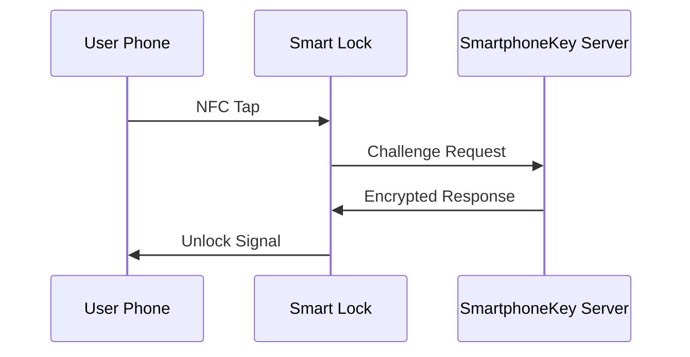

## Overview

SmartphoneKey transforms property access with app-free, contactless entry using Apple Wallet or Google Wallet. You manage everything through a web dashboard, eliminating physical keys and key fobs. Property managers enjoy enterprise-grade security, simple user provisioning, and hardware that installs in minutes with no ongoing maintenance.

<Columns cols={2}>
  <Card title="Contactless Entry" icon="smartphone" href="/docs/contactless-entry">
    Unlock doors by tapping your phone. No app downloads needed.
  </Card>
  <Card title="Enterprise Security" icon="shield" href="/docs/security">
    End-to-end encryption protects every interaction.
  </Card>
  <Card title="User Management" icon="users" href="/docs/user-management">
    Add residents and guests instantly via API or dashboard.
  </Card>
  <Card title="Low-Maintenance Hardware" icon="settings" href="/docs/hardware">
    Installs on existing locks. Battery lasts 5+ years.
  </Card>
</Columns>

## Contactless Entry via Mobile Wallets

You enable seamless entry by provisioning digital keys to Apple Wallet or Google Wallet. Residents hold their phone near the lock, and it unlocks automatically—no Bluetooth pairing or app required.

<Tabs>
  <Tab title="Apple Wallet" icon="apple">
    Provision keys directly to iOS devices. Supports PassKit for secure storage.

    <Steps>
      <Step title="Generate Key" icon="key">
        Create a pass in your dashboard for the resident's email.
      </Step>
      <Step title="User Receives" icon="download">
        They add it to Wallet via email link.
      </Step>
      <Step title="Tap to Enter" icon="smartphone">
        Hold phone to lock—unlocks in `<1s`.
      </Step>
    </Steps>
  </Tab>
  <Tab title="Google Wallet" icon="android">
    Use Google Wallet Passes for Android users. Integrates with device security.

    <Steps>
      <Step title="Create Pass" icon="key">
        Select Google format in dashboard.
      </Step>
      <Step title="Share Link" icon="share">
        Send secure link to guest's phone.
      </Step>
      <Step title="Instant Access" icon="zap">
        Tap NFC reader for entry.
      </Step>
    </Steps>
  </Tab>
</Tabs>

## Enterprise-Grade Security Protocols

SmartphoneKey uses AES-256 encryption, mutual TLS authentication, and dynamic key rotation. Every tap generates a unique challenge-response, preventing replay attacks.

<Callout kind="alert">
  You control access granularly: time-limited guest keys expire automatically after checkout.
</Callout>



## User and Guest Management Tools

Provision users via dashboard or REST API. Scale to thousands without performance loss.

<CodeGroup tabs="JavaScript,Python">
  ```javascript
  const response = await fetch('https://api.smartphonekey.com/v1/users', {
    method: 'POST',
    headers: { 'Authorization': `Bearer ${YOUR_API_KEY}` },
    body: JSON.stringify({
      email: 'guest@example.com',
      propertyId: 'prop_123',
      expiresAt: '2024-12-31T23:59:59Z'
    })
  });
  ```
  ```python
  import requests

  response = requests.post(
      'https://api.smartphonekey.com/v1/users',
      headers={'Authorization': f'Bearer {YOUR_API_KEY}'},
      json={
          'email': 'guest@example.com',
          'propertyId': 'prop_123',
          'expiresAt': '2024-12-31T23:59:59Z'
      }
  )
  ```
</CodeGroup>

<ParamField path="propertyId" param-type="string" required="true">
  Your property identifier from the dashboard.
</ParamField>

<ParamField query="duration" param-type="string" required="false">
  Optional stay duration in days (default: 7).
</ParamField>

## Low-Maintenance Hardware Design

Install the retrofit module on standard deadbolts in under 5 minutes. No wiring needed—powers via long-life lithium battery.

<Expandable title="Hardware Specifications" default-open="false">

- **Battery Life:** 5+ years (10 unlocks/day)
- **Weatherproof:** IP65 rating for outdoor use
- **Compatibility:** Kwikset, Schlage, Yale locks
- **Firmware Updates:** Over-the-air, zero downtime

Revoke access remotely if hardware is compromised.

</Expandable>

These features make SmartphoneKey ideal for multifamily properties and short-term rentals, reducing turnover costs by 40%. Start with a free trial to test in your building.