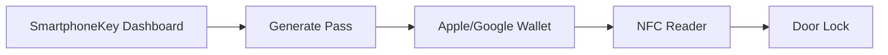

## Overview

SmartphoneKey integrates effortlessly with leading mobile wallets and property management systems (PMS). You gain app-free access for residents and guests while maintaining enterprise-grade security. Explore key integrations below.

<Columns cols={3}>
  <Card title="Apple Wallet" icon="apple" href="#">
    Add virtual keys to Apple Wallet for seamless NFC unlocking.
  </Card>
  <Card title="Google Wallet" icon="phone" href="#">
    Enable contactless entry using Google Wallet passes.
  </Card>
  <Card title="PMS Partners" icon="database" href="#">
    Sync with Yardi, AppFolio, and RealPage for automated access.
  </Card>
</Columns>

<Callout kind="info">
  All integrations require a SmartphoneKey Pro account. Contact support@smartphonekey.com for enterprise setup.
</Callout>

## Mobile Wallet Setup

Configure SmartphoneKey passes for Apple Wallet and Google Wallet. Follow platform-specific instructions to issue digital keys.

<Tabs>
  <Tab title="Apple Wallet" icon="apple">

    <Steps>
      <Step title="Enable Wallet Passes" icon="settings">
        In your SmartphoneKey dashboard, navigate to **Integrations > Apple Wallet** and upload your developer certificate.
      </Step>
      <Step title="Generate Pass" icon="download">
        Select a lock and resident, then generate the pass. Residents scan a QR code to add it to Wallet.
      </Step>
      <Step title="Test Unlock" icon="zap">
        Hold iPhone near the lock reader. Verify NFC detection in dashboard logs.
      </Step>
    </Steps>

  </Tab>
  <Tab title="Google Wallet" icon="phone">

    <Steps>
      <Step title="Register API" icon="settings">
        Go to **Integrations > Google Wallet** and register your project in Google Cloud Console.
      </Step>
      <Step title="Issue Pass" icon="download">
        Use the dashboard to create a pass object and send the JWT to residents via email or PMS.
      </Step>
      <Step title="Verify" icon="zap">
        Test with Android device. Check pass status in Google Wallet API.
      </Step>
    </Steps>

  </Tab>
</Tabs>

## Property Management Software Integration

Connect SmartphoneKey to your PMS for automatic key provisioning. Supported platforms include Yardi, AppFolio, and RealPage.

<Steps>
  <Step title="Choose Connector" icon="plug">
    Select your PMS from the dashboard under **Integrations > PMS**.
  </Step>
  <Step title="Authenticate" icon="lock">
    Enter your PMS API credentials. SmartphoneKey uses OAuth 2.0 for secure access.
  </Step>
  <Step title="Map Fields" icon="settings">
    Match resident data: unit number, move-in date, and access duration.
  </Step>
  <Step title="Sync Keys" icon="sync">
    Trigger initial sync. New leases auto-generate Wallet passes.
  </Step>
</Steps>

<Callout kind="tip">
  Use webhooks for real-time updates on lease changes. See API section below.
</Callout>

## Custom API and Webhooks

Build custom integrations using SmartphoneKey's REST API. Authenticate with `Authorization: Bearer YOUR_API_KEY`.

<CodeGroup tabs="Unlock Lock,Provision Key">
  ```javascript
  const response = await fetch('https://api.smartphonekey.com/v1/locks/123/unlock', {
    method: 'POST',
    headers: {
      'Authorization': 'Bearer YOUR_API_KEY',
      'Content-Type': 'application/json'
    },
    body: JSON.stringify({ user_id: 'resident-456' })
  });
  ```
  ```python
  import requests
  response = requests.post(
    'https://api.smartphonekey.com/v1/keys',
    headers={
      'Authorization': 'Bearer YOUR_API_KEY',
      'Content-Type': 'application/json'
    },
    json={'lock_id': '123', 'resident_email': 'user@example.com'}
  )
  ```
</CodeGroup>

### API Parameters

<ParamField path="lock_id" param-type="string" required="true">
  Unique lock identifier from your dashboard.
</ParamField>

<ParamField query="duration_minutes" param-type="integer" required="false">
  Access duration in minutes (default: `1440` for 24 hours).
</ParamField>

### Webhook Setup

Configure webhooks to receive events like `key_issued` or `access_denied`.

```javascript
// Example webhook payload
{
  "event": "door_unlocked",
  "lock_id": "123",
  "user_id": "resident-456",
  "timestamp": "2024-10-15T14:30:00Z"
}
```

## Hardware Compatibility

SmartphoneKey works with most NFC-enabled door hardware. Review requirements below.

| Hardware Type | Supported Models | Notes |
|---------------|------------------|-------|
| Schlage Encode | All | Native NFC support |
| August Smart Lock | Pro, Pro+ | Firmware v3.5+ |
| Yale Assure | Lock 2 | Requires bridge |
| Generic Readers | HID iCLASS SE | Contact support for certification |

<Expandable title="Advanced Compatibility Details" default-open="false">

Ensure readers support ISO 14443 Type A/B for Apple/Google Wallet. Minimum read range: `4cm`. Test with SmartphoneKey's compatibility tool in dashboard.



</Expandable>