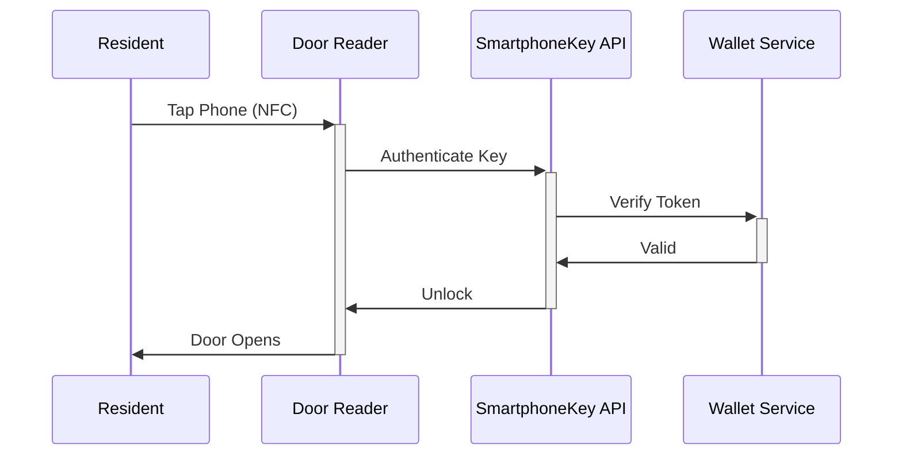

## Overview

SmartphoneKey revolutionizes access control for multifamily properties and short-term rentals. You provide residents and guests with secure, digital keys stored directly in Apple Wallet or Google Wallet—no apps required. This contactless solution delivers enterprise-grade security, simplifies installation, and reduces maintenance, helping property managers streamline operations while enhancing user experience.

<Columns cols={3}>
  <Card title="App-Free Access" icon="smartphone" href="/docs/setup">
    Residents tap their phone to unlock doors. No downloads or accounts needed.
  </Card>
  <Card title="Enterprise Security" icon="shield" href="/docs/security">
    Uses NFC and biometric authentication with end-to-end encryption.
  </Card>
  <Card title="Easy Management" icon="settings" href="/docs/dashboard">
    Control keys remotely via a web dashboard. Revoke access instantly.
  </Card>
</Columns>

## Core Benefits for Property Managers

You save time and costs with SmartphoneKey. Eliminate physical key distribution, reduce lockout calls by `>80%`, and cut rekeying expenses. Installation takes minutes per door—no wiring or batteries. Scale across hundreds of units effortlessly.

<Callout kind="success">
  Property managers report `50%` fewer access-related maintenance requests after switching to SmartphoneKey.
</Callout>

## How SmartphoneKey Works

Follow these steps to deploy SmartphoneKey in your property:

<Steps>
  <Step title="Install Hardware" icon="download">
    Mount the SmartphoneKey reader on your door. Connects via standard wiring.
  </Step>
  <Step title="Generate Digital Keys" icon="key">
    Use the dashboard to create keys for residents. Share via email or QR code.
  </Step>
  <Step title="Enable Wallet Access" icon="wallet">
    Residents add keys to Apple or Google Wallet automatically.
  </Step>
  <Step title="Grant Guest Access" icon="users">
    Issue temporary keys for short-term rentals. Auto-expire after checkout.
  </Step>
</Steps>



## Apple Wallet vs Google Wallet

Choose the best option for your residents:

<Tabs>
  <Tab title="Apple Wallet" icon="apple">
    Seamless integration for iOS users. Supports Express Mode for instant unlocks without unlocking the phone.
    
    <Image
      src="https://images.unsplash.com/photo-1556656793-08538906a9f8?w=600"
      alt="iPhone with Apple Wallet open showing access card"
      width="600"
      height="400"
    />
  </Tab>
  <Tab title="Google Wallet" icon="android">
    Works on Android devices. Pixel and Samsung users get ultra-fast NFC performance.
    
    <Image
      src="https://images.unsplash.com/photo-1511707171634-5f897ff02aa9?w=600"
      alt="Android phone with Google Wallet showing access pass"
      width="600"
      height="400"
    />
  </Tab>
</Tabs>

## Target Use Cases

SmartphoneKey excels in multifamily housing and short-term rentals:

| Use Case | Key Advantage | Example |
|----------|---------------|---------|
| Apartment Complexes | Bulk key management | Issue/revoke for `500+` units |
| Condo Buildings | Guest access control | Temporary keys for visitors |
| Short-Term Rentals | Automated check-in/out | Keys expire post-stay |
| Gated Communities | Perimeter security | Multiple doors per property |

<Expandable title="Frequently Asked Questions" default-open="false">
  ### Does SmartphoneKey require resident apps?
  
  No. Keys live in native Wallet apps.
  
  ### What if a phone is lost?
  
  Revoke the key remotely from your dashboard. Issue a new one instantly.
  
  ### Integration with existing systems?
  
  Use our REST API:
  
  <CodeGroup tabs="JavaScript,cURL">
  ```javascript
  const response = await fetch('https://api.smartphonekey.com/v1/keys', {
    method: 'POST',
    headers: { 'Authorization': `Bearer ${YOUR_API_KEY}` },
    body: JSON.stringify({ userId: 'resident-123', expiresAt: '2024-12-31' })
  });
  ```
  ```bash
  curl -X POST https://api.smartphonekey.com/v1/keys \
    -H "Authorization: Bearer YOUR_API_KEY" \
    -d '{"userId": "resident-123", "expiresAt": "2024-12-31"}'
  ```
  </CodeGroup>
</Expandable>

<Callout kind="tip">
  Start with a pilot on `10` doors to see `30%` time savings immediately.
</Callout>