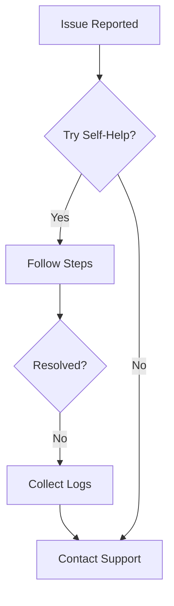

## Hardware and Connectivity Issues

SmartphoneKey relies on Bluetooth Low Energy (BLE) for secure, app-free door unlocking. Common problems include signal interference, power failures, or firmware mismatches. Follow these steps to diagnose and resolve hardware issues.

<Callout kind="tip">
  Always power off the SmartphoneKey device before inspecting hardware connections to avoid electrical hazards.
</Callout>

<Steps>
  <Step title="Verify Power Supply" icon="zap">
    Check that the device LED shows a steady green light, indicating power. If blinking red, replace the batteries or inspect wiring.
  </Step>
  <Step title="Test Bluetooth Range" icon="wifi">
    Approach within `2m` of the door with a test phone. Use the SmartphoneKey admin app to scan for the device ID.
  </Step>
  <Step title="Reset Device" icon="settings">
    Press and hold the reset button for `10 seconds` until the LED flashes blue. Re-pair via the admin portal.
  </Step>
  <Step title="Firmware Update" icon="download">
    Connect via USB and run the update tool:

    ```bash
    smartphonekey-firmware --update --device /dev/ttyUSB0
    ```

  </Step>
</Steps>

## User Access and Wallet Issues

Residents may report failed unlocks due to wallet provisioning errors or expired credentials. Differentiate solutions by platform.

<Tabs>
  <Tab title="Apple Wallet" icon="apple">
    <Steps>
      <Step title="Re-add Pass" icon="refresh-cw">
        Instruct users to delete the SmartphoneKey pass from Wallet app, then scan the QR code again from your resident portal.
      </Step>
      <Step title="Check Express Mode" icon="check-circle">
        Ensure Express Mode is enabled: Wallet > Pass > `⋮` > Express Mode.
      </Step>
    </Steps>
  </Tab>
  <Tab title="Google Wallet" icon="phone">
    <Steps>
      <Step title="Verify NFC" icon="smartphone">
        Confirm device NFC is on: Settings > Connected devices > Connection preferences > NFC.
      </Step>
      <Step title="Re-provision Pass" icon="refresh-cw">
        Remove pass from Google Wallet, then tap "Add to Wallet" from the shareable link.
      </Step>
    </Steps>
  </Tab>
</Tabs>

## System Maintenance and Error Logs

Regular log reviews prevent escalations. Access logs via SSH on your gateway device.

<CodeGroup tabs="Access Logs,Error Logs">
  ```bash
  # Tail live access events
  tail -f /var/log/smartphonekey/access.log | grep "unlock"

  # Example output:
  2024-10-15T14:30:22 [INFO] User: john.doe@tenant.com | Device: SK-12345 | Action: unlock_success
  ```
  ```bash
  # Filter errors
  grep "ERROR" /var/log/smartphonekey/system.log

  # Example output:
  2024-10-15T14:32:10 [ERROR] ERR-1001: BLE timeout on door-101 | Retry count: 3
  ```
</CodeGroup>

| Error Code | Description | Resolution |
|------------|-------------|------------|
| `ERR-1001` | BLE connection timeout | Check batteries and interference |
| `ERR-2002` | Invalid wallet pass | Re-provision pass for user |
| `ERR-3003` | Firmware mismatch | Update to latest version |
| `ERR-4004` | Gateway offline | Restart gateway service: `systemctl restart smartphonekey-gateway` |

<Expandable title="Advanced Log Analysis" default-open="false">
  Use these commands for deeper insights:

  ```bash
  # Count failed unlocks by user
  awk '/unlock_failed/ {print $3}' /var/log/smartphonekey/access.log | sort | uniq -c | sort -nr

  # Export to JSON for dashboard
  jq . /var/log/smartphonekey/events.json
  ```
</Expandable>

## Quick Resolution Cards

<Columns cols={3}>
  <Card title="No LED Light" icon="alert-triangle" href="/docs/installation#power-check">
    Inspect wiring and batteries first.
  </Card>
  <Card title="Unlock Fails Silently" icon="x-circle" href="/docs/user-management#credential-sync">
    Sync credentials in admin portal.
  </Card>
  <Card title="Intermittent Connectivity" icon="wifi-off" href="/docs/hardware#range-optimization">
    Relocate gateway or add repeaters.
  </Card>
</Columns>

## When to Contact Support

If issues persist after these steps, gather diagnostics first.

<Callout kind="alert">
  Provide support with device ID (`SK-XXXXX`), error logs, and timestamps for faster resolution.
</Callout>

Contact our 24/7 support at support@smartphonekey.com or via the admin portal ticket system. Include:

- Device serial number
- Recent log snippet
- Affected user emails



This covers `90%` of reported issues, ensuring minimal downtime for your property.